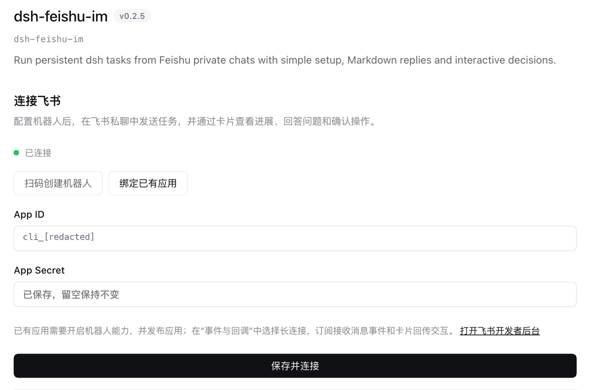
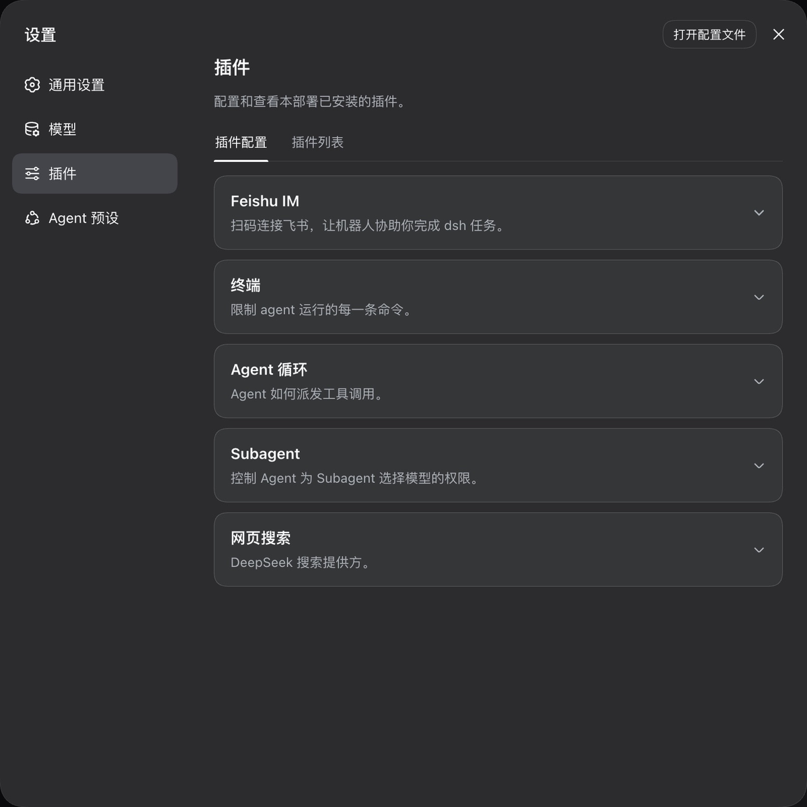
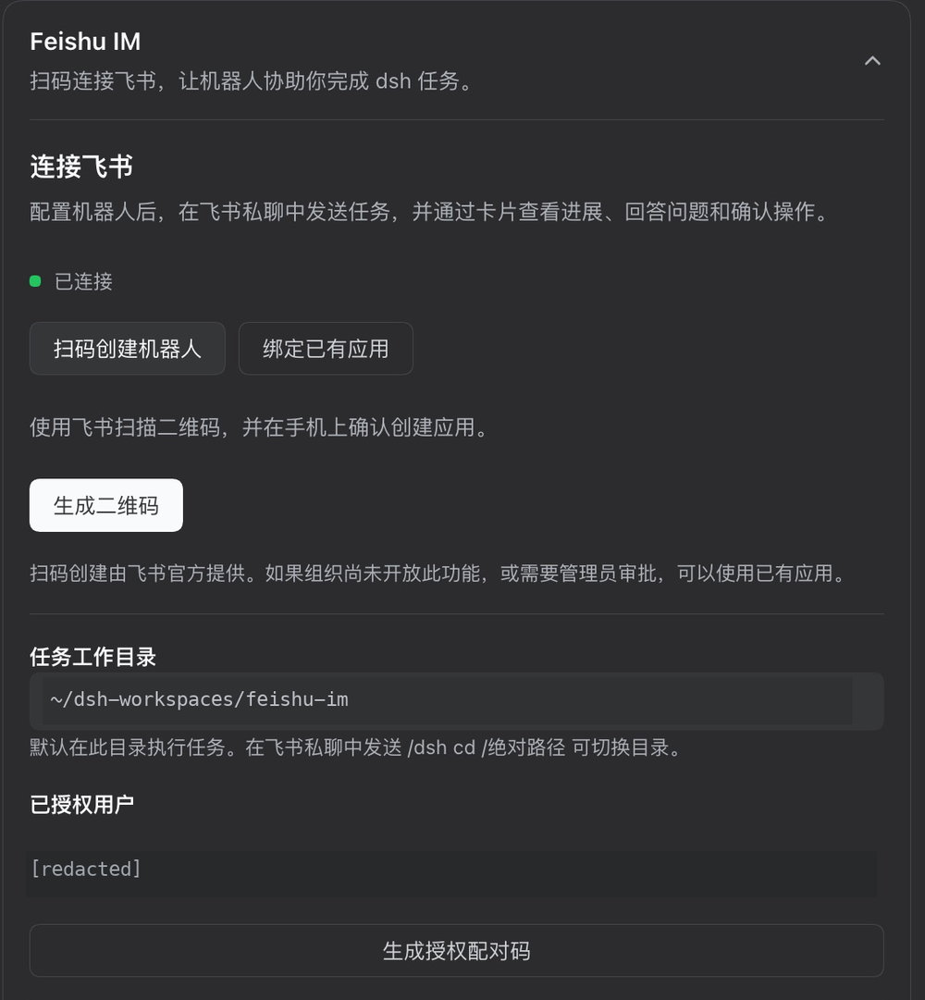

# Feishu IM for dsh

[简体中文](README.zh-CN.md) · [Setup with screenshots](#connect-a-bot) · [Configuration](docs/configuration.md) · [Operations](docs/operations.md)

Run dsh tasks in private Feishu bot chats. The plugin calls Feishu OpenAPI directly and receives long-connection events through the official Node SDK. **No lark-cli installation is required.**

- Choose **Create a bot with QR** or **Bind an existing app**. Binding needs only App ID / App Secret; the default workspace is created automatically.
- Authorize your Feishu account with a single-use pairing code. Only explicitly authorized private text messages start tasks.
- Completed tasks stay in **Ungrouped**. Ordinary messages continue the task; chat commands create tasks, archive them and change directories while keeping users isolated.
- Progress cards update task stages, tool status and public assistant explanations; a separate Feishu Markdown rich-text post delivers the result. Raw reasoning blocks and tool outputs are not forwarded.
- Interactive cards collect approvals, single/multiple choices and custom answers.

## Install

Use Node.js `^22.19.0` or `>=24.0.0`. The minimum supported dsh is **`0.1.5-rc.2`**; `0.1.7-alpha.2` and Desktop's **`0.2.0-rc.2`** are also tested. Existing `0.1.5-rc.2` installations do not need an upgrade. See the [compatibility matrix](docs/compatibility.md) for supported prerelease ranges.

Build an installable package from this repository:

```sh
npm ci
npm run build
mkdir -p artifacts
npm pack --pack-destination artifacts
dsh plugin --profile web add "$PWD/artifacts/dsh-feishu-im-0.2.5.tgz"
```

Use the absolute path: dsh runs pnpm inside the profile directory. A bare `artifacts/package.tgz` can be interpreted as a GitHub repository and fail with `ERR_PNPM_GIT_RESOLVE_FAILED`. Changing GitHub authentication does not fix that path.

For **DSH Desktop**, install `artifacts/dsh-feishu-im-0.2.5.tgz` through Desktop's plugin manager into the profile it runs. Desktop's bundled runtime can differ from the `dsh --version` in your terminal. Version 0.2.5 declares support for the tested `0.2.0-rc.2` runtime; no compatibility exemption is needed. The command above targets the separate Web profile.

pnpm 11+ may require a decision about the `protobufjs` install script. The dsh Plugins page offers **Allow these scripts and retry**. That script only checks dependent version ranges. Alternatively, explicitly set `allowBuilds.protobufjs: false` in this profile's `pnpm-workspace.yaml` and retry; the plugin is tested with that script denied. Preserve other workspace settings.

Restart `dsh --profile web` after installing into the Web profile, then follow the illustrated setup below. The channel runs beside the existing Web application runner.

## Connect a bot

Setup has three steps: **open the configuration page → connect a bot → authorize your Feishu account**. Desktop and Web offer the same connection methods; configure the profile you actually use.

### 1. Open the configuration page

| Host | Where to configure |
| --- | --- |
| Desktop / newer Web | Sidebar **Plugins → dsh-feishu-im**. The configuration sits between the plugin description and **Included components**. |
| Older Web, such as dsh `0.1.5-rc.2` | **Settings → Plugins → Plugin configuration → Feishu IM**. Click the card or its right-hand arrow to expand it. |

**Desktop: bind an existing application on the plugin detail page.** Only App ID and App Secret are required.



**Web: expand the Feishu IM card alongside the built-in plugin settings.**



These screenshots show plugin `0.2.5` in the Chinese UI: Desktop on dsh `0.2.0-rc.2`, Web on `0.1.5-rc.2`. They are cropped; application and user identifiers are redacted, and the home directory is abbreviated as `~`. They show an already-connected bot; complete the steps below for first-time setup.

### 2. Choose one connection method

| Method | What you need | Action |
| --- | --- | --- |
| **Create a bot with QR** | Feishu on your phone; permission to create an application in your organization | Generate a QR code, scan it and confirm on your phone. |
| **Bind an existing app** | A published Feishu bot application, its App ID and App Secret | Enter the two values and click **Save and connect**. |

**Create a bot with QR:** Select **Create a bot with QR → Generate QR code**. Scan the generated code with Feishu and confirm on your phone. Credentials are saved on success. This official registration flow is subject to your organization's app creation permissions and administrator approval; use an existing application if it is unavailable.



When Feishu returns the scanner's open_id, only that user is authorized. Otherwise, complete pairing in step 3. Feishu controls availability of QR permission/callback prefilling. If messages or card actions do not arrive after registration, verify the settings below, long-connection mode and publication status in the developer console.

**Bind an existing app:** In the [Feishu developer console](https://open.feishu.cn/app), create an enterprise self-built app or open your existing one. Enable its bot capability, select **long connection** under Events & Callbacks, configure the following and publish an app version:

| Type | Identifiers |
| --- | --- |
| App-identity permissions | `im:message:send_as_bot`, `im:message.p2p_msg:readonly` |
| Message event | `im.message.receive_v1` |
| Card callback | `card.action.trigger` |

Choose **Bind an existing app**, enter only App ID and App Secret, then **Save and connect**. International Lark applications can set `apiOrigin` through [advanced configuration](docs/configuration.md). Saved secrets never return to the browser; a blank secret keeps the existing value only for the same App ID.

No user OAuth login or public callback server is required for either method.

### 3. Authorize your account and send a task

**Connected** means the bot connection is ready; your Feishu account must also appear under **Authorized users** before it can start tasks.

1. Wait for **Connected**. If QR registration already authorized your account, skip pairing.
2. Otherwise, copy the complete `/dsh pair …` command from the configuration page and send it to the bot in a **private chat using your own Feishu account**. Saving an app with no authorized users displays a code automatically; use **Generate pairing code** if you need another. Each code expires after ten minutes and works once.
3. After the bot confirms pairing, send `/dsh status` to check the directory, then a task such as “List the files in the current working directory.”

The default workspace `~/dsh-workspaces/feishu-im` is created automatically; no directory input is required during setup. To work on an existing project, send `/dsh cd /Users/you/projects/my-project` in the bot chat before your task, replacing the example with an existing directory. See [Use](#use) for task and directory commands.

Existing authorizations for the same app are preserved; replacing the app clears them by default. Generate another pairing code on the same page to add a user. Only explicitly authorized private chats can start tasks.

## Use

```text
Find why this project's tests fail
/dsh status
/dsh stop
/dsh new
/dsh cd /Users/you/projects/my-project
/dsh archive
/dsh help
```

Completed and stopped tasks remain in dsh's **Ungrouped** list. Ordinary messages continue the current task. `/dsh new` prepares a new task for the next prompt and keeps the old task; `/dsh archive` stops and archives the current task and clears its waiting queue. The next prompt starts a fresh task. `/dsh cd PATH` changes this private chat's directory and prepares a fresh task. Absolute, relative and `~` paths are supported; spaces do not need quotes. The target directory must exist, be readable/writable and remain outside the profile. Wait for a running task to finish, or send `/dsh stop` and wait for it to stop before switching. `/dsh status` shows activity, the waiting queue and the current directory.

New tasks use dsh's current default model and Agent preset. Existing tasks retain their preset. Chat bindings and directories survive restart. Configured `cwd` is the default for new chats; use `/dsh cd` to change an existing chat. Applications and users stay isolated. Headings, lists, links, tables and code render as native Feishu Markdown posts; split code blocks retain their language and fences.

Only the task's initiating user can answer its card in the original private chat. **Allow once** grants just that action. Rejection, cancellation, expiry and restart never grant permission; dsh's `never` approval policy still applies. Requests that cannot be displayed completely fail closed.

A failed reply never reruns task side effects. Feishu controls event delivery during disconnection; the plugin cannot guarantee complete offline replay.

## Upgrade from 0.1

Version 0.2 removes `command`, `profile`, `maxRecordBytes` and `graceMs`. It never reads or copies lark-cli credentials.

Install into an existing Web profile and configure credentials again. Remove an old `headless-runner` override only if it belongs to `dsh-feishu-im`; preserve other runners. The profile defaults live under `id: feishu-im`, `config.account`. On dsh before 0.1.7, Web settings are saved by dsh in the `feishu-im.account` namespace in its settings document.

Continuing old history requires the original Session store, workspace and an explicit `legacyNamespace` matching the old CLI profile name. Preset-free legacy sessions cannot resume under a Web preset; retain their original composition or start fresh. See [configuration](docs/configuration.md).

## Develop and verify

```sh
npm run check
npm run build
npm run test:integration
npm run package:check
```

Integration tests install the tarball into an isolated real dsh Web profile and use local fake Feishu HTTP/WebSocket endpoints and a fake model. They cover configuration, pairing, tool execution and restart deduplication without sending real messages. [Architecture](docs/architecture.md) · [Compatibility](docs/compatibility.md) · [Security](SECURITY.md)
