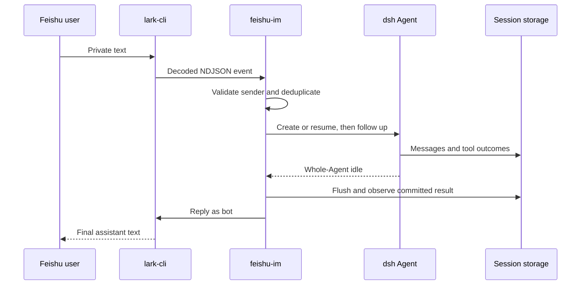

# Architecture

The plugin is a task driver inside a dsh profile. Cordis owns its lifetime; the Agent registry owns task execution; Session persistence owns conversation history; the subprocess provider owns lark-cli processes. No Harness source patch is required.

## Installation and startup

The npm package declares `dsh.bundle.patch`. Installation into a new profile adds this layer after `dsh-base`. Its `headless-runner` row is the profile's application driver, a row that dsh already audits as required at startup. A missing module, invalid configuration, or missing injected service therefore fails startup. Use a dedicated profile; this bundle does not coexist with another application runner.

The `feishu-im` management executable configures or diagnoses that profile. It never creates a Cordis application or starts an Agent. Runtime execution always uses `dsh --profile <name>`.

## Conversation ownership

The Session id hashes the lark-cli profile, workspace, private chat id, and sender open_id. This retains the original driver's identity algorithm and separates authorized users. A worker exclusively owns its Agent until its queue drains. A later message resumes the same saved Session; a live Agent owned by another component cannot be adopted. Preset-based Sessions require their original composition and are rejected.

One worker submits one follow-up at a time. Stable user message ids recover admission deduplication from saved inbox and user-message events. An interrupted admitted message is not automatically rerun. `/dsh stop` cancels the active Agent and removes unstarted queue entries. Disposal cancels and drains owned work, closes consumer stdin, and escalates through the subprocess provider only after the grace period.

## Transport and trust

lark-cli owns credentials, websocket transport, and reconnection. The driver waits for the documented subscription-ready marker, validates bounded UTF-8 NDJSON, and accepts only allowlisted humans in private text conversations. Content is passed as a literal logged user message, never shell syntax. Tool permissions remain owned by the dsh profile.

Replies select committed assistant text without reasoning or tool payloads. Each chunk respects the complete JSON content byte limit and carries a deterministic idempotency key. Flush and Feishu delivery are separate operations. There is no durable inbox for unadmitted messages, offline polling, exactly-once task execution across crashes, or durable reply outbox.

## Modules

| Module | Responsibility |
| --- | --- |
| `src/index.ts` | Cordis activation and shutdown |
| `src/config.ts` | Deployment validation and defaults |
| `src/protocol.ts` | Wire parsing, conversation ids, byte limits |
| `src/transport.ts` | CLI event and reply processes |
| `src/driver.ts` | Authorization, task ordering, history, results |

The driver owns no independent registry or projection, so it publishes no runtime-invariant companion. Tests observe the actual Agent, subprocess, persisted transcript, and user-visible replies.

## Management and extraction

Harness separates the Agent API and loop, Session persistence, model providers, filesystem tools, subprocess services, and profile bundles. This driver consumes those published services and adds no agent-loop changes. The original interaction package is therefore independently installable through the supported bundle extension point.

`src/messages.ts` owns control-message translations. `src/lark-auth.ts` queries public CLI discovery commands and retains only minimal identity fields. `src/profile.ts` validates installed profiles and updates their patch under a lock. `src/management.ts` implements setup, doctor, and reset. The management executable directly depends on its schema library because ordinary Node execution does not use dsh's host-module resolver.
