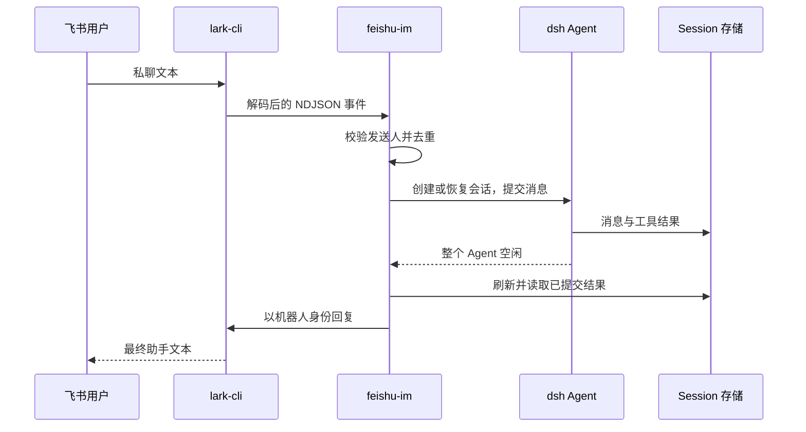

# 架构设计

[English](architecture.md)

插件作为 dsh profile 内的任务驱动运行。Cordis 管理插件生命周期，Agent registry 执行任务，Session persistence 保存对话，subprocess provider 管理 lark-cli 子进程。独立包不需要修改 Harness 源码。

## 与 Harness 结构的对应

Harness 的核心 Agent API、循环实现和 Session 持久化分别承担执行、生命周期及历史存储；模型提供方、文件和子进程能力通过独立服务注入。bundle 配置把这些插件组装成 profile，应用启动必须经过 dsh。原仓库中的交互驱动因此可拆成独立 npm bundle，复用这些公开扩展点，无需侵入 agent-loop。

独立包通过 `dsh.bundle.patch` 声明配置层，新 profile 在 `dsh-base` 之后加载它。插件占用 dsh 已审计的 `headless-runner` 应用启动行，保证模块缺失、配置错误或依赖注入不满足时明确启动失败。一个 profile 只配置一个应用启动器。

`feishu-im` 可执行文件只负责配置和诊断，不创建 Cordis 应用，不运行 Agent。实际启动始终使用 `dsh --profile <name>`。配置命令直接依赖 schema 库，避免依赖仅在 dsh 启动时生效的宿主模块解析。

## 会话及资源管理

Session id 对应用 profile、工作目录、私聊 id、用户 open_id 做哈希，保留原驱动的算法。worker 在其队列处理期间独占 Agent；后续消息恢复相同 Session。拒绝接管其他组件仍持有的 Agent，也拒绝需要原始 preset 组合的历史。

同一会话一次只提交一条 follow-up。稳定的用户消息 id 用于从持久化的 inbox 与 user-message 事件恢复去重记录。已接收后中断的消息不会自动重跑。`/dsh stop` 取消当前 Agent 并清空未启动队列；插件卸载时取消并等待自己拥有的工作，关闭 CLI stdin，宽限期后才交由进程管理服务终止。

## 传输与信任

lark-cli 负责凭据、WebSocket 和重连；驱动等待订阅 ready 标记，对有字节上限的 UTF-8 NDJSON 做校验，只接受白名单人类的私聊文本。文本作为可从日志重建的用户消息提交，不拼接成 shell 命令。工具权限继续由 dsh profile 决定。

回复仅选择已提交的助手文本，不发送思考过程或工具载荷。分片限制包含完整 JSON 内容的字节数，每片具有确定性幂等键。Session 刷新和飞书发送不是同一事务；当前没有离线补拉、未接收消息的持久化队列、崩溃下严格一次工具执行或持久化回复队列。

## 源码位置

| 模块 | 职责 |
| --- | --- |
| `src/index.ts` | Cordis 激活、启动审计与关闭 |
| `src/config.ts` | 参数校验与默认值 |
| `src/protocol.ts` | 事件解析、会话 id、字节限制 |
| `src/transport.ts` | CLI 事件和回复子进程 |
| `src/driver.ts` | 授权、顺序执行、会话历史和结果 |
| `src/messages.ts` | 中英文控制提示 |
| `src/lark-auth.ts` | 公开 CLI 查询与最小身份字段解析 |
| `src/profile.ts` | profile 校验和配置文件更新 |
| `src/management.ts` | setup、doctor、reset 命令 |

插件不维护独立注册表或数据投影，因此不发布空的 runtime-invariant 模块；测试直接检查 Agent、子进程、持久化记录和用户回复。
